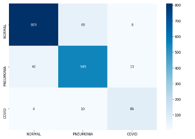
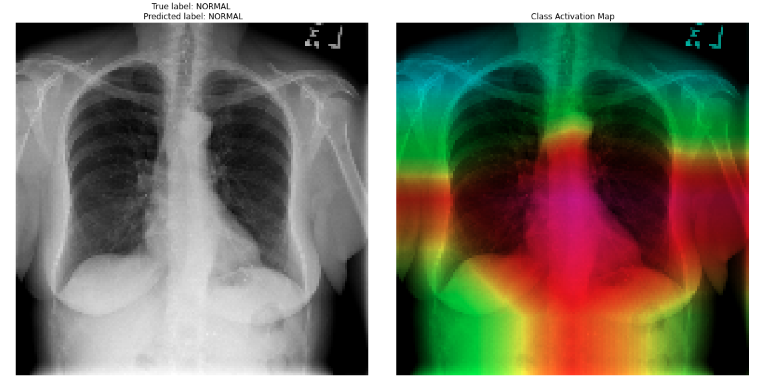
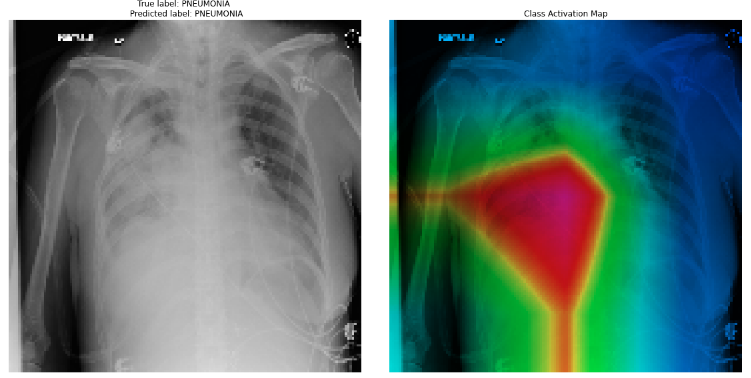
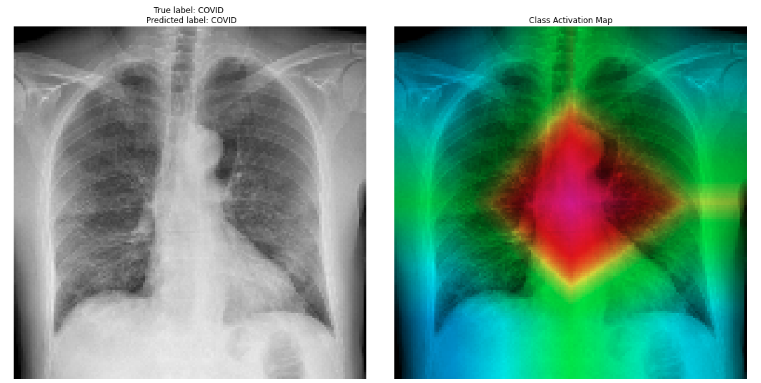
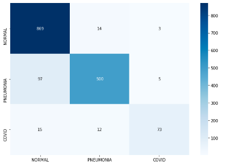
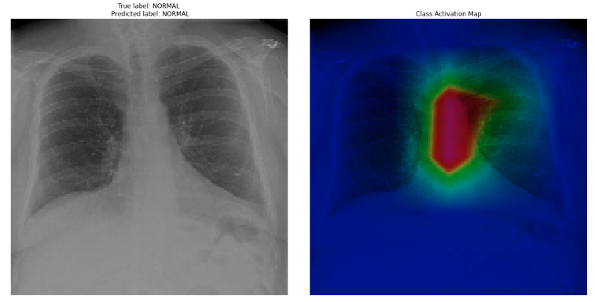
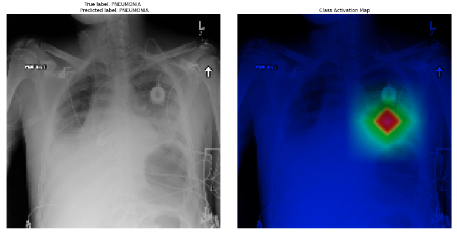
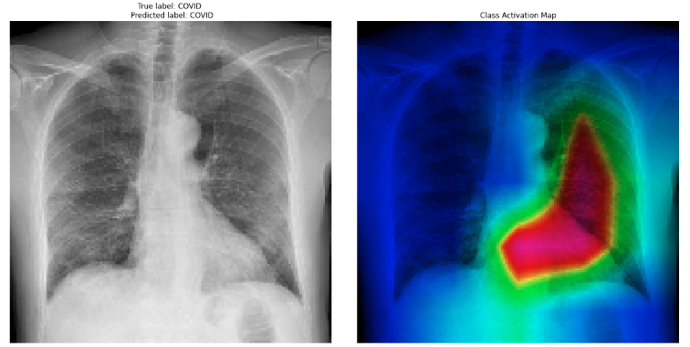

# COV-IR-Net
The coronavirus outbreak came to light on December 31, 2019 when China informed the WHO of a cluster of cases of pneumonia of an unknown cause in Wuhan City in Hubei Province. Subsequently the disease spread to more Provinces in China, and to the rest of the world. The WHO has now declared it a pandemic. The virus has been named SARS-CoV-2 and the disease is now called COVID-19. \
It was found in early studies that patients present abnormalities in chest radiography images that are characteristic of those infected with COVID-19. We detect such features to classify the X-ray images as Normal , Pneumonia and Covid.

## Biodata:
I am a highschool student, machine learning and deep learning entusiast. \
This is my summer project based on the ongoing pandemic of COVID-19.\
All suggetions are welcome. \
Contact me by mail - hamza11223300@gmail.com

## Content :
1. [Requirements](#requirements) to install on your system
2. [generating COVID dataset](instructions/DataProcessing.md)
3. Steps for creating, training and evaluation of the [model](instructions/ModelPreparation.md)
4. [Results](#results)
5. [Heatmap](Codes/heatmap_Github.ipynb) generation
6. [models](instructions/models.md)

## Requirements

The main requirements are listed below:

* Tensorflow 1.15
* OpenCV 4.2.0
* Python 3.7
* Numpy
* Scikit-Learn
* Matplotlib
* Shutil
* Tqdm 4.45.0 
* Jupyter notebook

## Results

### Inception-V3:

<table class="tg">
  <tr>
    <th class="tg-7btt" colspan="3">Sensitivity (%)</th>
  </tr>
  <tr>
    <td class="tg-7btt">Normal</td>
    <td class="tg-7btt">Pneumonia</td>
    <td class="tg-7btt">COVID-19</td>
  </tr>
  <tr>
    <td class="tg-c3ow">91.3</td>
    <td class="tg-c3ow">91.1</td>
    <td class="tg-c3ow">86</td>
  </tr>
</table>

#### Heatmaps:
##### Normal:

##### Pneumonia:

##### covid:

### Resnet:

<table class="tg">
  <tr>
    <th class="tg-7btt" colspan="3">Sensitivity (%)</th>
  </tr>
  <tr>
    <td class="tg-7btt">Normal</td>
    <td class="tg-7btt">Pneumonia</td>
    <td class="tg-7btt">COVID-19</td>
  </tr>
  <tr>
    <td class="tg-c3ow">98</td>
    <td class="tg-c3ow">83</td>
    <td class="tg-c3ow">73</td>
  </tr>
</table>

#### Heatmaps
##### Normal:

##### Pneumonia:

##### covid:

